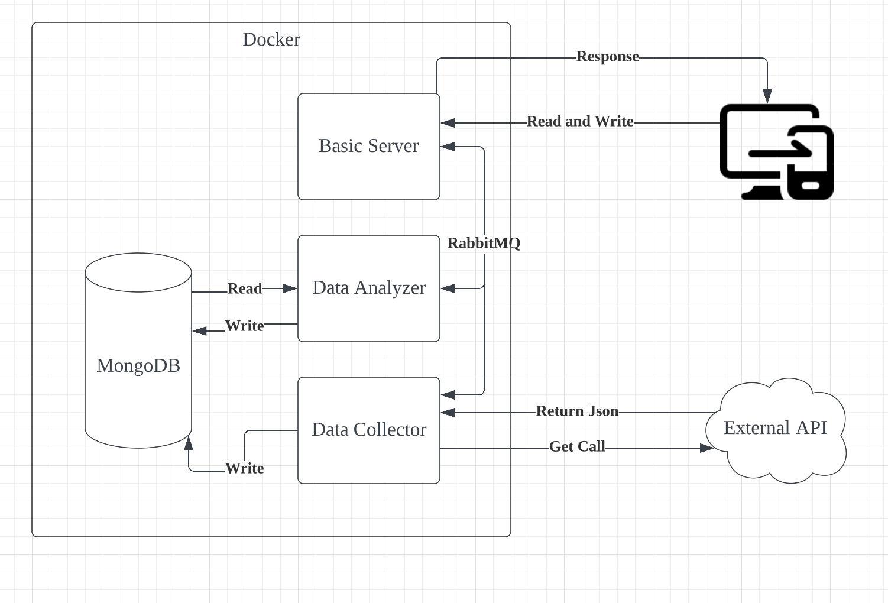
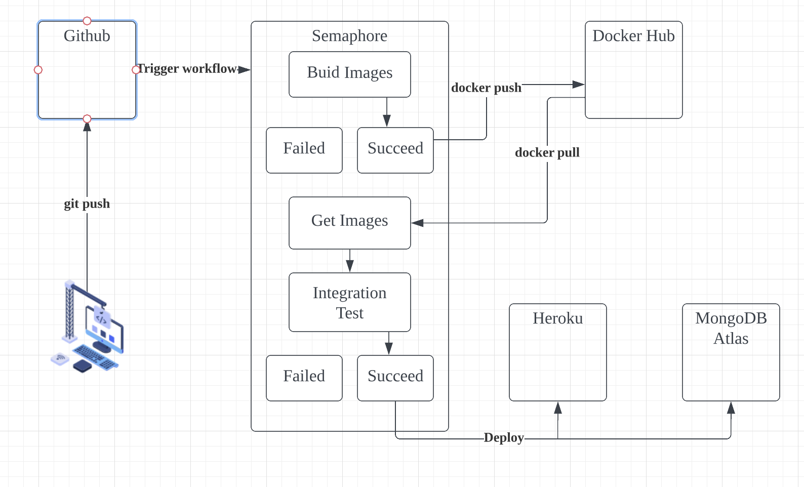
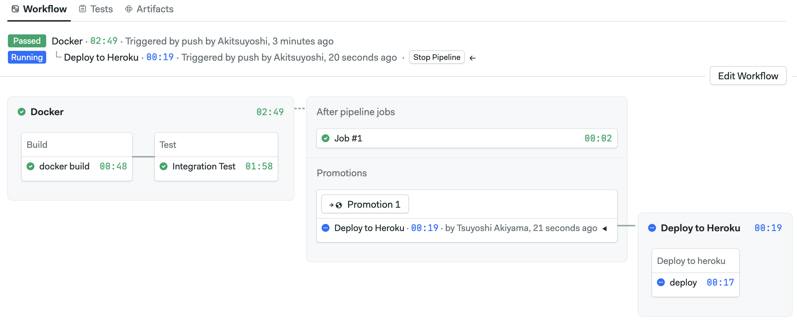

# FINAL HOMEWORK

[](https://akitsuyoshi.semaphoreci.com/projects/final_bigdata_homework)

This project contains 3 applications and 1 database.

* Basic web application
* Data analyzer
* Data collector
* Database

Single web applications, Basic web app, with two background workers.

## WHITEBOARD ARCHITECTURE

### SYSTEM ARCHITECTURE


### CICD ARCHITECTURE


## TECH STACK
This codebase is written in Javascript, using express.js library for web servers. The codebase is tested with Jest and supertest and uses npm to build and install the all web applications. Docker is used to containalized sevices, including mongoDB, and apply RabbitMQ to communicate 3 server apps with each other. We apply Semaphore for CI/CD, while hosting this project on Heroku.

## GETTING STARTED

### PREREQUISITE

Installed Docker and MongoDB on your local machine, and get them running.

### SETUP
```sh
## In the terminal

# if no output is seen here, please install and run MongoDB then.
> ps -ef | grep mongod | grep -v grep

# if no output here, please install and run docker.
> docker ps

> docker-compose up --build
```

After setup and run the app on local, you will get 3 web apps

- `http://localhost:3000` for basic web app
- `http://localhost:3001` for data analyzer
- `http://localhost:3002` for data collector

### TEST and CI/CD
The test commands are followed. Test files are in each app's tests folder.
```sh
## In the terminal

# For Unit test
> docker-compose run basic_server npm test

# For Integration test, communicating server with MongoDB
> docker-compose run data_analyzer npm test
> docker-compose run data_collector npm test
```

CI/CD pipelines are seen in the [CI/CD ARCHITECTURE](#cicd-architecture) section. Every push and merge to main branch will trigger Semaphore CI/CD pipeline workflow. Then, promote changes to production, heroku and mongoDB Atlas. Semaphore workflow look something like this.





### DATA COLLECTOR

Once you call post `http://localhost:3002/us_data`, the endpoint requests to external api to get US population data and save them to MongoDB. Calling get `http://localhost:3002/us_data` endpoint will show the saved data. The endpoints code are written in [data_collector app.js](applications/data_collector_server/app.js)

```sh
## In the terminal

# Post to request us population data from external api and save them to db
> curl -X POST http://localhost:3002/us_data

# Get saved us data from db
> curl -X GET http://localhost:3002/us_data
```

### DATA ANALYZER
If you call get `http://localhost:3002/us_data`, the endpoint will show the saved US data. If you don't see the saved us data, please post `http://localhost:3002/us_data` beforehand. Calling get `http://localhost:3001/us_data_average` will show the average US population between 2013 and 2020. The endpoints code is written in [data_analyzer app.js](applications/data_analyzer_server/app.js)

```sh
## In the terminal

# Get saved us data from db. If no output are seen here, please POST http://localhost:3002/us_data beforehand.
> curl -X GET http://localhost:3002/us_data

# Get us data average population
> curl -X GET http://localhost:3001/us_data_average
```

### MONITOR METRICS ENDPOINTS
The 2 GET endpoints below will show the app's condition.

- `http://localhost:3000/health`

    → Returns 200 ok

- `http://localhost:3000/metrics`

    → Returns meaningful metrics given by prometheus

### RABBITMQ

After `docker-compose up --build`, you will see 3 web apps running. If you post `localhost:3000/rabbit_publish`, it publish the sample message. The data_analyzer app will get received the published message.

```sh
## In a new terminal window

> curl -X POST http://localhost:3000/rabbit_publish

## In another window to see the published msg

> docker-compose logs -f data_analyzer
```

## REFERENCES

- [external api url](https://datausa.io/api/data?drilldowns=Nation&measures=Population)
- [class starter code](https://github.com/initialcapacity/kotlin-ktor-starter)
- [CI for semaphore](https://semaphoreci.com/community/tutorials/dockerizing-a-node-js-web-application)
- [CD for heloku, semaphore, and mongo Atlas](https://semaphoreci.com/community/tutorials/continuous-deployment-of-a-python-flask-application-with-docker-and-semaphore)
- [RabbitMQ implementation in node.js using docker](https://geshan.com.np/blog/2021/07/rabbitmq-docker-nodejs/)